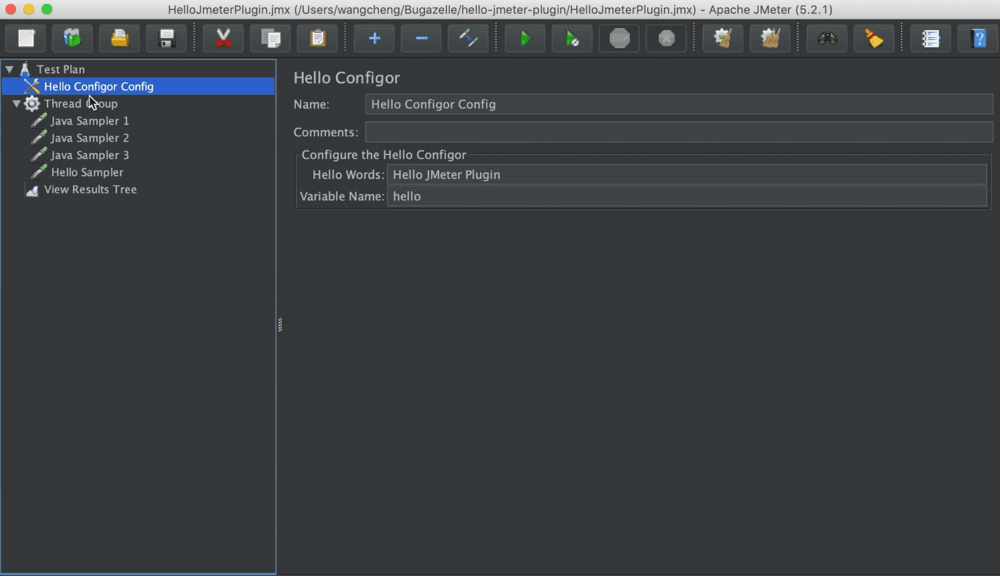
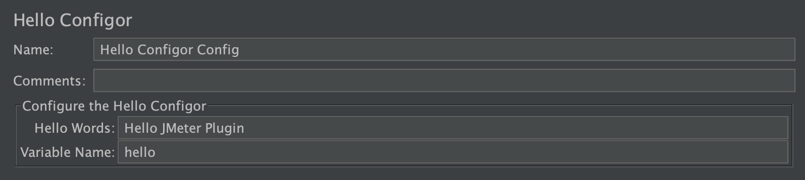
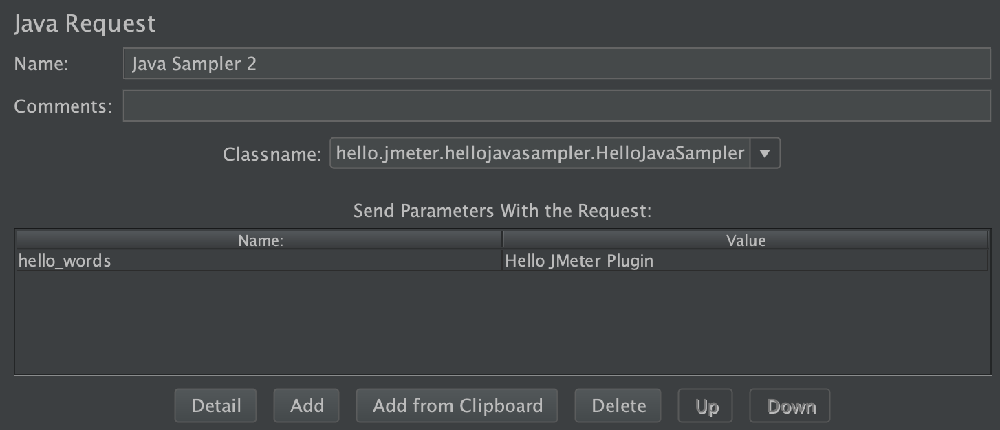
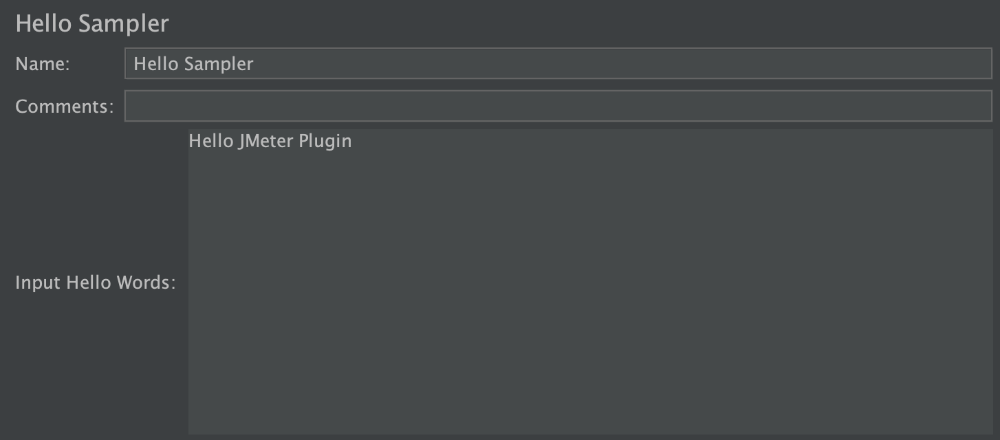

Hello World, Hello JMeter Plugin
====================

> 中文文档，请查看微信公众号：

Here are the clear & brief sample to create custom JMeter plugin.

The plugins here are very handy, something like: Hello World

Contains:

**1. Hello Configor:** A Config Element, and user could input hello words, and JMeter read the words, and save to parameter

**2. Hello Function:** A custom function __hello to fulfil: Hello xxx, today is xxx

**3. Hello Java Sampler:** A Java Sampler to fulfil: Hello xxx, today is xxx

**4. Hello Sampler:** A Sampler to fulfil: Hello xxx, today is xxx



## Guide

- [How to Build](#how-to-build)
- [pom.xml](#pom.xml)
- [Hello Configor](#hello-configor)
- [Hello Function](#hello-function)
- [Hello Java Sampler](#hello-java-function)
- [Hello Sampler](#hello-sampler)

## How to Build

Use maven to build, then **HelloJMterPlugin-x.x.x.jar** could be ready

``` 
mvn clean package
```

> After test, the jar is compatible with JMeter 2.x, 3.x, 4.x, 5.x

## pom.xml

Here are the best practise for [pom.xml](https://github.com/Bugazelle/hello-jmeter-plugin/blob/master/pom.xml)

1. For JMeter Dependencies

    ```
    <dependency>
        <groupId>org.apache.jmeter</groupId>
        <artifactId>ApacheJMeter_core</artifactId>
        <version>5.2.1</version>
        <scope>provided</scope>
    </dependency>
    ```

    1) **version:** Choose a proper version based on your project

    2) **scope:** provided
     
       Because JMeter itself could provide the jar, no need to export
       
       For more info, please refer to: https://howtodoinjava.com/maven/maven-dependency-scopes/
        
    3) **All the JMeter jar files are here:** https://mvnrepository.com/artifact/org.apache.jmeter
       
       If you confused about which jar provide which functions, check here:
           
       - Simply see what content in it: `jar tf xxx.jar`
           
       - For java doc: https://javadoc.io/doc/org.apache.jmeter
             
       - For download java doc (rename jar to zip, and unzip): https://repo1.maven.org/maven2/org/apache/jmeter/
        
       - For official API documentation: https://jmeter.apache.org/api/

       For example:
       
       ApacheJMeter_core.jar: All the core logic and mechanism
       
       ApacheJMeter_java.jar: All the core protocol mechanism
       
       ApacheJMeter_components.jar: All the component, such as assertion, pre/post processors, listener

2. Maven Build Plugin
    
     1) **maven-compiler-plugin:** 
     
        Mandatory, compile the source, more info: https://maven.apache.org/plugins/maven-compiler-plugin/
    
     2) **maven-shade-plugin:**
      
        Suggested, provides the capability to package the artifact in an uber-jar, more info: https://maven.apache.org/plugins/maven-shade-plugin/
    
## Hello Configor

A Config Element, and user could input hello words, and JMeter read the words, and save to parameter



A JMeter config element needs at least 3 parts:

1. \<YourConfigName\>.java

   Here is: [HelloConfigor.java](https://github.com/Bugazelle/hello-jmeter-plugin/blob/master/src/main/java/hello/jmeter/helloconfigor/HelloConfigor.java)
    
   All the core logic are here, such as define/get/process user input
    
2. \<YourConfigName\>BeanInfo.java
   
   Here is: [HelloConfigorBeanInfo](https://github.com/Bugazelle/hello-jmeter-plugin/blob/master/src/main/java/hello/jmeter/helloconfigor/HelloConfigorBeanInfo.java)
   
   Set the default values for the user input

3. \<YourConfigName\>Resources.properties

   Here is: [HelloConfigorResources.properties](https://github.com/Bugazelle/hello-jmeter-plugin/blob/master/src/main/java/hello/jmeter/helloconfigor/HelloConfigorResources.properties)
   
   Set the JMeter GUI info, such as label name, comment

## Hello Function

A custom function __Hello to fulfil: Hello xxx, today is xxx


1. Only one java file to make things ready: [HelloFunction.java](https://github.com/Bugazelle/hello-jmeter-plugin/blob/master/src/main/java/hello/jmeter/functions/HelloFunction.java)

   The java mainly needs to do the 3 things:
   
   1) Show the custom function name in Function Helper
   
   2) Show the parameter description in Function Helper
   
   3) Core logic in "execute"
   
2. Note: For jmeter functions, all the source files should be put into: "functions" folder
   
## Hello Java Sampler

A Java Sampler to fulfil: Hello xxx, today is xxx



Only 1 java file to make things ready: [HelloJavaSampler.java](https://github.com/Bugazelle/hello-jmeter-plugin/blob/master/src/main/java/hello/jmeter/hellojavasampler/HelloJavaSampler.java)

Contain 4 main parts:

1. getDefaultParameters

   Set the default values for parameters, if empty, please set null

2. setupTest

   This is where you read test parameters and initialize your test client. JMeter calls this method only once for each test thread

3. teardownTest

   Clear the mess after the test
   
4. runTest

   All the core logic put here

## Hello Sampler

A Sampler to fulfil: Hello xxx, today is xxx



Here are the things we need to know:

1. Suggest to use Java Sampler instead if possible, that is much simple

2. For more info about how to create sampler: https://github.com/apache/jmeter/tree/master/src/examples/src/main

3. The Hello Sampler contains 2 java files:

   1) [HelloSampler.java](https://github.com/Bugazelle/hello-jmeter-plugin/blob/master/src/main/java/hello/jmeter/hellosampler/HelloSampler.java)
   
      - Should override "sample"
      
      - getTitle: get sampler lable
      
      - getHello: get user input words
      
    2) [HelloSamplerGui.java](https://github.com/Bugazelle/hello-jmeter-plugin/blob/master/src/main/java/hello/jmeter/hellosampler/gui/HelloSamplerGui.java)
    
       - Should override "getStaticLabel" and "getLabelResource" to set the sampler lable
       
       - Should override "configure" to get user put
       
       - Should override "createTestElement" and "modifyTestElement" to create new sampler, and save user input to JMeter properties
       
       - Should override "clearGui"
       
       - Should create "createDataPanel" to set GUI info, such as label for parameters

At last, if you think this really do a help to you.
Please give the repo a STAR 🌟


